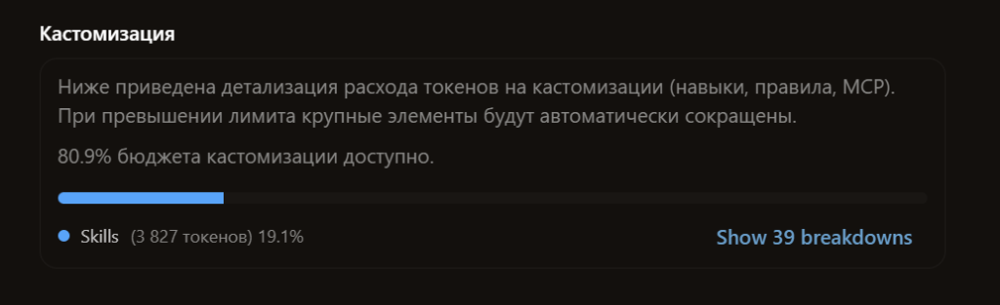

# Antigravity Companion: Русский интерфейс + Виджет лимитов

[](https://github.com/voronin-s-dev/antigravity-companion)
[](CHANGELOG.md)
[](LICENSE)
[](#)

Автономный модуль расширения для **Google Antigravity Desktop App**. Добавляет полный, естественный перевод интерфейса на русский язык (включая все выпадающие списки, настройки проектов, слэш-меню и навыки), настраиваемый виджет мониторинга лимитов моделей с режимами закрепления в сайдбаре и плавающего окна, а также встроенные инструменты контроля расхода токенов и шагов сессии.

---

## 🌟 Главные возможности

### 1. Полная локализация интерфейса (Русский язык)
* **Меню приложения**: `Файл` (`Новый диалог`, `Создать проект`, `Палитра команд`), `Правка`, `Вид` (`Увеличить/Уменьшить/Сбросить масштаб`), `Окно` (`Свернуть`, `Развернуть`).
* **Параметры проектов и выпадающие списки**:
  * Меню проекта: `Параметры проекта`, `Скопировать имя проекта`, `Настройки проекта`, `Удалить проект`.
  * Пресеты безопасности: `Турбо-режим`, `Стандартный`, `Строгий`, `Пользовательский`.
  * Политика проверки документов: `Всегда продолжать`, `Спрашивать каждый раз`.
  * Ширина переписки: `Узкая`, `По умолчанию`, `Широкая`.
  * Стиль интерфейса (Skin): `Для разработчиков`, `Упрощённый`.
  * Контрастность и темы: `Контрастность (Высокая / По умолчанию)`, `Светлая по умолчанию`, `Тёмная по умолчанию`.
  * Очередь сообщений: `В очередь до завершения ответа`, `Отправлять сразу`.
  * Разрешения: правила файлов, сети, терминала и инструментов MCP.
* **Главный экран и чат**: Селектор проектов (`Без проекта`, `Новый проект`, `Быстрый старт`), плейсхолдер ввода (`Спросите о чем угодно, @ для упоминания, / для действий`), сайдбар (`Показать все`), относительное время («только что», «вчера», «5д», «1нед»).
* **Слэш-команды и Кастомизация**: Меню команд (`/goal`, `/plan`, `/browser`, `/btw`, `/grill-me`, `/teamwork-preview`, `/learn`, `/boost`), раздел «Кастомизация» в Настройках, шкала расхода токенов (`3 827 / 20 000 токенов (19.1%)`), навыки и MCP-серверы.
* **Безопасность кода**: Блоки исходного кода, подсветка синтаксиса, терминал и ваши личные промпты **не затрагиваются**.

### 2. Умный виджет лимитов моделей
* **Два режима размещения**:
  * **В боковой панели (`Sidebar`)**: Виджет аккуратно встроен в левый сайдбар Antigravity над Настройками с двустрочным Flex-выравниванием. При клике всплывает детальная карточка.
  * **Плавающий виджет (`Floating`)**: Свободно перемещаемая по экрану пилюля с автоматическим прилипанием к границам экрана.
* **Официальные векторные иконки брендов**: Google Gemini (фиолетовая искра) и Anthropic Claude (фирменный терракотовый астериск) вместо громоздкого текста.
* **Мониторинг квот**: Раздельный учет моделей Gemini и моделей Claude / GPT.
* **5-часовые и недельные квоты**: Наглядные индикаторы процентов и времени до восстановления.
* **Интерактивный тултип с астрономическим прогнозом (ETA)**: При наведении на плашку процентов всплывает подсказка с живым обратным отсчетом секунд и точным местным временем сброса (`⏱ Сброс через 2ч 15м 30с (в 18:45)` или `(ср, в 13:41)`).
* **Кастомизация миниатюры**: В настройках виджета (иконка ⚙️) можно выбирать чекбоксами, какие именно лимиты отображать (Gemini 5ч, Gemini нед, Claude 5ч, Claude нед).
* **Цветовая палитра и пипетка**: Выбор любого оттенка окна или использование экранной пипетки для точного подбора цвета под тему оформления.
* **Двуязычность**: Мгновенное переключение языка интерфейса и виджета (RU ⇄ EN) прямо из настроек виджета.
* **Ультракомпактный размер**: Оптимизирован под минимальное занимаемое место на экране.
* **Встроенный репортер непереведенных элементов (`Ctrl+V`)**: Кнопка `📸` в шапке виджета позволяет вставить скриншот из буфера обмена по `Ctrl+V`, написать комментарий и в 1 клик создать GitHub Issue.
* **Плавная анимация**: Кнопка «Обновить» вращает только внутреннюю иконку стрелочки, hover-бокс остается неподвижным.

### 3. Экономия токенов и защита контекста (Token Budget Guard)
* **Индикатор шагов сессии (`Шаг X/40`)**:
  * Встроенный счетчик глубины текущего диалога прямо в сайдбаре и развернутом виджете.
  * **Адаптивная цветовая индикация**: нейтральный серый (1–24 шага) $\rightarrow$ янтарный предупреждающий (25–34 шага) $\rightarrow$ красный критический (35–40 шагов).
  * Предупреждает о достижении сессионного потолка для исключения экспоненциального сжигания токенов ($O(N^2)$ сложность при повторной отправке раздутого контекста) и рекомендует своевременно выполнить `/handoff` или начать свежий чат.
* **Pre-flight Paste Guard (Защита от случайной вставки гигантского текста)**:
  * Интеллектуальный перехват вставки в строку ввода чата.
  * При копировании больших фрагментов (> 35 строк или > 1200 символов — дампы логов, стек-трейсы, JSON) появляется аккуратный предупреждающий тост с подсчетом строк и приблизительного числа токенов без блокировки набора текста.
* **Супервизор с автоматическим сбросом кэша (Cache Busting)**:
  * Служба инвалидирует in-memory кэш Node.js при перезапуске окон Electron, гарантируя подгрузку самых свежих скриптов и словарей с диска.

---

## 📸 Нашли непереведенный элемент? Помогите улучшить перевод!

Интерфейс Antigravity постоянно развивается и получает регулярные обновления. Если вы заметили кнопку, подсказку или раздел, оставшийся на английском языке — отправьте нам скриншот!

### Пример непереведенного элемента:


> **На скриншоте выше:** В блоке расхода токенов кнопка `Show 39 breakdowns` и название категории `Skills` отображались на английском языке. Такие случаи оперативно вносятся в словарь.

### Как отправить скриншот:

#### Способ 1: Прямо через виджет лимитов (В 2 клика)
1. Сделайте снимок экрана с непереведенным элементом (`Win + Shift + S` в Windows).
2. В шапке виджета нажмите иконку фотокамеры **`📸`** (*«Сообщить о непереведенном элементе»*).
3. Нажмите **`Ctrl + V`** — снимок мгновенно прикрепится с живым превью.
4. Добавьте краткий комментарий и нажмите **«Создать Issue на GitHub»**.

#### Способ 2: Через вкладку GitHub Issues
* Откройте [GitHub Issues](https://github.com/voronin-s-dev/antigravity-companion/issues/new/choose) и выберите готовую форму **«Непереведенный элемент интерфейса»**.
* Вставьте скриншот через `Ctrl + V` прямо в поле описания.

#### Способ 3: Для разработчиков (Локальное добавление)
1. Создайте временный файл `localization/translations_to_merge.json` с новыми парами:
   ```json
   {
     "exact": {
       "Show breakdown": "Показать детализацию"
     },
     "patterns": [
       { "regex": "^Show\\\\s+(\\\\d+)\\\\s+breakdowns?$", "replace": "Показать детализацию ($1)" }
     ]
   }
   ```
2. Выполните команду `npm run merge` — скрипт автоматически сольет словарь, проверит тестами (`npm test`) и применит изменения в работающем окне Antigravity.
3. Отправьте Pull Request в наш репозиторий.

---

## 🚀 Быстрая установка (в 1 клик)

1. Скачайте и распакуйте архив `antigravity-companion` в любую постоянную папку (например, `C:\Tools\antigravity-companion` или в папку вашего пользователя).
2. Запустите файл **`install.bat`**.

> Скрипт проверит наличие Node.js (при необходимости предложит установить его автоматически через Windows Package Manager `winget`), создаст тихий ярлык автозагрузки Windows и немедленно активирует виджет и перевод в Antigravity. Окно установщика никогда не закроется самовольно, а полный протокол запишется в `install.log`.

---

## 🛡️ Контроль обновлений и приватность

### 100% оффлайн по умолчанию (Никаких скрытых обновлений)
По умолчанию служба работает **полностью локально** и не отправляет никаких сетевых запросов. Вы полностью контролируете, когда и как обновлять компоненты.

### Центр обновлений (`update_dictionary.bat`)
В дистрибутив встроен интерактивный центр управления:
* **[1] Harvester**: сканирование открытого интерфейса Antigravity на появление новых английских фраз после официальных апдейтов (сохраняются в `untranslated_queue.json`).
* **[2] Hot-Reload**: применение изменений словаря в открытом окне без перезапуска Antigravity.
* **[3] Обновление с GitHub**: загрузка свежего словаря из официального репозитория сообщества с автоматическим созданием резервной копии (`dictionary_ru.json.bak`).
* **[4] Заморозка обновлений (Offline-режим)**: создание файла `.lock_updates`, который намертво блокирует любые внешние сетевые запросы на обновление.

---

## 🛠️ Управление и диагностика

* **`companion.bat`** — интерактивный **Центр управления** (статус, рестарт, автозапуск Windows, проверка обновлений).
* **`launch_antigravity.bat`** — одновременный запуск Antigravity и службы Companion в один клик.
* **`bin\status.bat`** — проверка статуса (запущен ли Antigravity, порт CDP, активность фоновой службы, статус автозагрузки).
* **`bin\stop.bat`** — временная остановка службы.
* **`uninstall.bat`** — полное удаление службы из автозапуска Windows.

---

## 🤝 Участие в разработке (Contributing)

Мы приветствуем вклад сообщества в развитие перевода:
1. Если вы заметили непереведённую строку, нажмите иконку **`📸`** в виджете или запустите `update_dictionary.bat` (пункт 1).
2. Создайте **Pull Request** или **Issue** в репозиторий.

---

## 📋 Системные требования
* **ОС**: Windows 10 / Windows 11 (64-bit).
* **Среда**: Node.js 18+ (установщик `install.bat` находит установленный Node или помогает установить автоматически).
* **Приложение**: Google Antigravity Desktop App.
